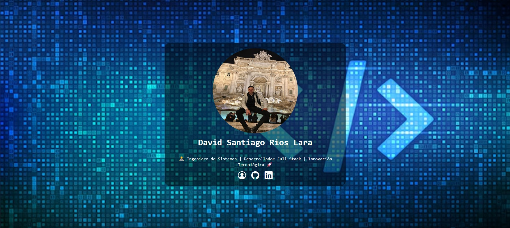

# [David Santiago Rios Lara ](https://david21rios.github.io/Tarjeta_perfil/)

## 📜 Resumen 📜
👨‍💻 Ingeniero de Sistemas | Desarrollador Full Stack | Innovación Tecnológica 🚀

## 💻 Instalación 💻
- Ubicarse dentro de la carpeta que contendrá el proyecto
- Abrir terminal de comandos
  - git clone https://david21rios.github.io/Tarjeta_perfil/
  - cd Tarjeta_perfil
  - Levantar la web en un servidor y disfrutar

## 👨‍💻 Tecnologías usadas 👨‍💻
| Tecnología | Versión | Descripción                                                                     |
|------------|---------|---------------------------------------------------------------------------------|
| HTML       | 5       | Lenguaje de Marcas que define el significado y la estructura del contenido web. |
| CSS        | 3       | Lenguaje de estilos utilizado para describir la presentación de documentos.     |

## 🤗 Redes sociales 🤗
- 🐭 GitHub: https://github.com/david21rios/ 🐭
- 🐭 LinkedIn: https://www.linkedin.com/in/davidriosl/ 🐭
- 🐭 Portfolio: https://davidriosl.com/ 🐭